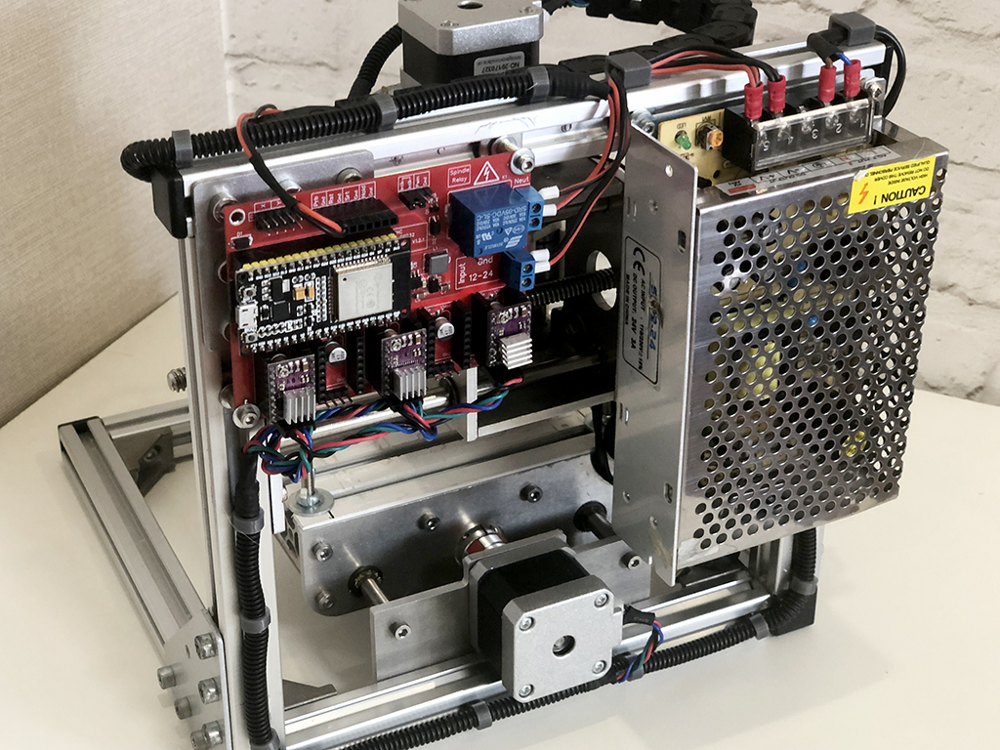
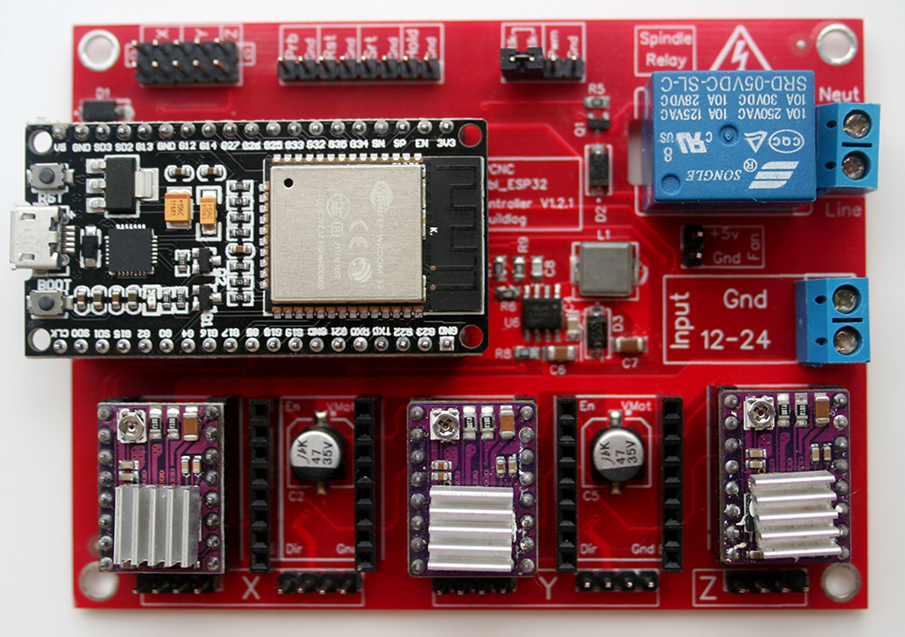
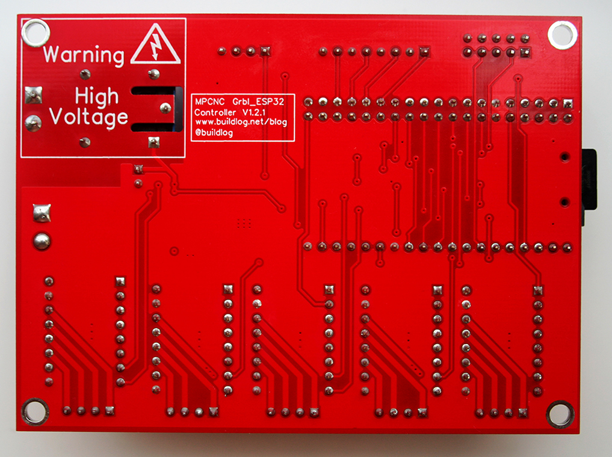
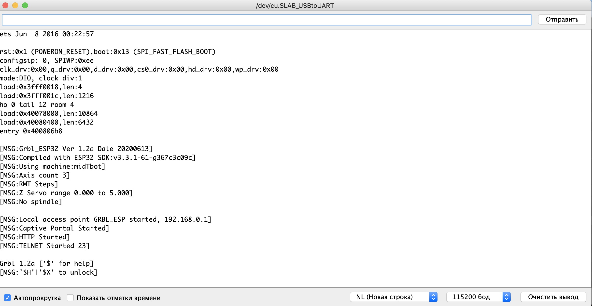
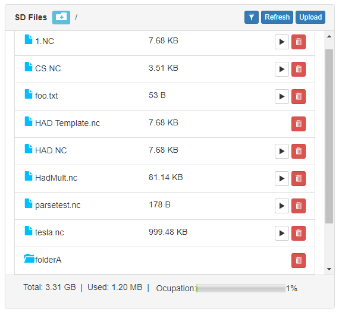
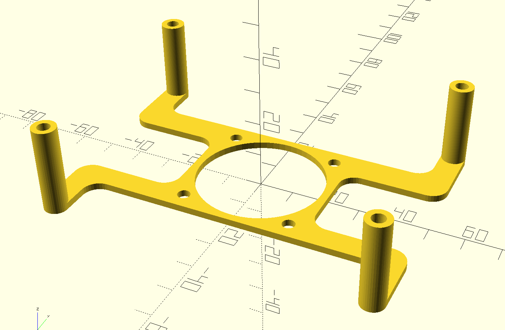

Контроллер ЧПУ
==============

GRBL контроллер на плате ESP32. Применяется для фрезерного станока, 3D-роутера, 3D-принтера, лазерного резака, винилового резака, плазменного резака с ЧПУ. Почитать подробнее можно на [тут](https://github.com/bdring/Grbl_ESP32_MPCNC_Controller).

Я использую для небольшого ЧПУ станка для хоббийных дел **T8 DIY CNC Engraver**.



## Плата

|   Верх                  | Низ
|-------------------------|-----------------------
|     | 

## BOM:

|Name|Desc|Value
|---|---|---
|C1, C2, C3, C5, C9|Capacitor, Electrolytic|47u 35V
|C4|Capacitor Ceramic|100nF 50V
|C6|Capacitor Ceramic|10uF
|C7|Capacitor Ceramic|22uF 6.3V
|C8|Capacitor Ceramic|150pF 50v 0805
|D1, D2, D3|Diode Schottkey|3A
|J1|Connector Header|Male 1x8 0.1
|J2, J4, J6, J7, J9, J11|Connector Header|Male 1x4 0.1
|J3|Connector Header|Male 2x5 0.1
|J8|Connector Header|Male 1x2 0.1
|J10|Socket Micro SD|TF-01A
|K1|Relay|5V
|L1|Inductor|4.7uH 5.5A
|Q1|Transistor|NPN 0.5A
|R1, R2, R3, R4, R10|Resistor|10k
|R5|Resistor|1K
|R6|Resistor|210k
|R7|Resistor|40.2k
|R8, R9|Resistor|100k
|TB1, TB2|Terminal Block|1x2 5mm Blue
|U1, J5|Connector Header|ESP-32 Female 1x19 0.1
|U2, U3, U4, U5, U7|Connector Header|Female 1x8 0.1
|U6|DC-DC Power Supply Controller|MP1584EN
|U8|Voltage level Shifter|TXS0101DBVR

## Прошивка в Arduino IDE

- При первой заливке скетча Grbl_Esp32 в ESP32 убедитесь, что он не вставлен в плату контроллера!
- JSON файл (Пакет **esp32**): ```https://raw.githubusercontent.com/espressif/arduino-esp32/gh-pages/package_esp32_index.json```
- Выбираем плату **ESP32 Dev Module** и схему **Minimal SPIFFS (1.9MB APP с OTA / 190KB SPIFFS)** в меню "Инструменты":


- Компилируем **Grbl\_Esp32/Grbl\_Esp32.ino**
- Загружаем. При появлении ```Connecting........``` нужно удерживать кнопку "BOOT" на плате ESP32. При нормальной загрузке должно быть: ```Leaving... Hard resetting via RTS pin...```
- Проверяем настройки в "Мониторе порта". Нажимаем RESET на плате и видим:



## Настройка моторов

- Если моторы имеют неверное вращение, то разворачиваем разъем на 180 градусов
- Сбрасываем по умолчанию ```$rst = $```
- Проверка на парковку: ```$H```
- Установка тока двигателя для мотора **NEMA 17** (1,5A): 

A4988:

```
Vref = Current Limit * 8 * 0,100(RS) = 1,5 / 1,25 = 1,2V
```

DRV8825 (на 70%):

```
Vref = Imax / 2 = 0,7 * 1,5 / 2 = 0,5V
```

## WebUI (Wi-Fi)

При первом включении будет создана точка доступа Wi-Fi со следующими настройками:

- SSID: ```GRBL_ESP```
- Пароль: ```12345678```
- IP-адрес : ```192.168.0.1```

Нужно подключится и загрузить файл данных ```Grbl_Esp32/data/index.html.gz```, содержащий веб-интерфейс.

Если скомпилировали прошивку с помощью ```ENABLE_AUTHENTIFICATION``` в ```config.h```, WebUI будет иметь двух пользователей с именами "admin" и "user". Если входим как "admin/admin", то  можем изменить любой параметр. Если вы вошли как "user/user", можем взаимодействовать только с Grbl. (Имена пользователей и пароли можно настроить перед компиляцией, отредактировав config.h).

Далее в **WebUI** нужно настроить как Wi-Fi клиент, а не точка доступа.

## Bluetooth

Как настроить написано тут: https://github.com/bdring/Grbl_Esp32/wiki/Using-Bluetooth

## Создание G-Code

Есть очень много программ для создания G-Code. Пользуйтесь к которой привыкли.

Далее закадываем файл на карту памяти и в **WebUI** выбераем его.



## Охлаждение

Если плата или драйвера шаговых двигателей греются, то можно распечатать держатель вентилятора охлаждения на 5в.



## Контакты

GitHub автора: [https://github.com/bdring/Grbl_ESP32_MPCNC_Controller](https://github.com/bdring/Grbl_ESP32_MPCNC_Controller)

Grbl Esp32: [https://github.com/bdring/Grbl_Esp32](https://github.com/bdring/Grbl_Esp32)

Связаться со мной: info@dementiev.net